<div align="center">

# 🛡️ AegisGate

### Privacy-Preserving Compliance & Accredited Investor Verification for DeFi

[](https://soliditylang.org/)
[-375BD2?logo=chainlink>)](https://chain.link/)
[](https://worldcoin.org/)
[](https://plaid.com/)
[](https://nextjs.org/)
[](https://sepolia.etherscan.io/)

**AegisGate** bridges traditional finance compliance (KYC/AML/Accredited Investor checks) with on-chain DeFi access — **without ever exposing sensitive personal or financial data on the blockchain.**

[Architecture](#-architecture-overview) · [Confidential Compute](#-chainlink-confidential-compute-the-core-innovation) · [How It Works](#-how-it-works) · [Setup](#-getting-started)

</div>

---

## 📋 Table of Contents

- [The Problem](#-the-problem)
- [Our Solution](#-our-solution)
- [Architecture Overview](#-architecture-overview)
- [Chainlink Confidential Compute — The Core Innovation](#-chainlink-confidential-compute-the-core-innovation)
- [How It Works](#-how-it-works)
- [Tech Stack](#-tech-stack)
- [Project Structure](#-project-structure)
- [Smart Contract Deep Dive](#-smart-contract-deep-dive)
- [CRE Workflow Deep Dive](#-cre-workflow-deep-dive)
- [Frontend Deep Dive](#-frontend-deep-dive)
- [Getting Started](#-getting-started)
- [Demo](#-demo)
- [Security Considerations](#-security-considerations)
- [Future Roadmap](#-future-roadmap)

---

## 🔴 The Problem

DeFi protocols face an impossible tension:

| Requirement               | Challenge                                                                     |
| ------------------------- | ----------------------------------------------------------------------------- |
| **Regulatory Compliance** | Protocols must verify users are accredited investors, pass KYC/AML checks     |
| **User Privacy**          | Users don't want their bank balances, identity documents, or SSN on-chain     |
| **Decentralization**      | Relying on a centralized compliance server defeats the purpose of DeFi        |
| **Sybil Resistance**      | One person shouldn't be able to create multiple identities to game the system |

**Today, protocols either skip compliance (risking legal action) or collect sensitive data centrally (risking breaches and defeating decentralization).**

---

## 💡 Our Solution

AegisGate is a **privacy-preserving compliance layer** that uses:

- **🌐 World ID** — Proof of unique personhood (no personal data revealed)
- **🏦 Plaid** — Secure bank balance verification (balance checked, not stored)
- **🔒 Chainlink CRE (TEE)** — All sensitive verification runs inside a Trusted Execution Environment — the **Chainlink DON nodes themselves** never see your raw data
- **⛓️ On-Chain Smart Contract** — Only stores a boolean `isAccredited` flag + an anonymous nullifier hash

**Result: DeFi protocols can check `isCompliant(wallet)` — getting a simple yes/no — with zero access to the underlying personal data.**

```
┌──────────────────────────────────────────────────────────┐
│              WHAT GOES ON-CHAIN                          │
│                                                          │
│  ✅ Nullifier Hash (anonymous identifier)                │
│  ✅ isAccredited: true / false                           │
│  ✅ Verification timestamp + expiry                      │
│  ✅ Cryptographic attestation proof                      │
│                                                          │
│  ❌ NO bank balances    ❌ NO personal info              │
│  ❌ NO identity docs    ❌ NO account numbers            │
│  ❌ NO SSN / passport   ❌ NO financial history          │
└──────────────────────────────────────────────────────────┘
```

---

## 🏗 Architecture Overview

### System Architecture

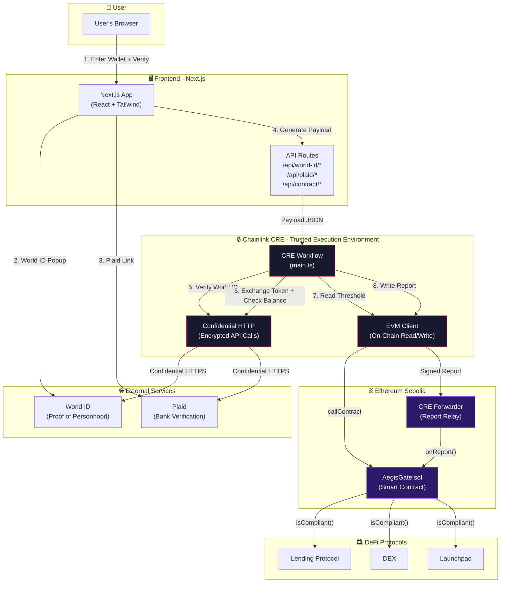

### Data Flow — What Stays Private

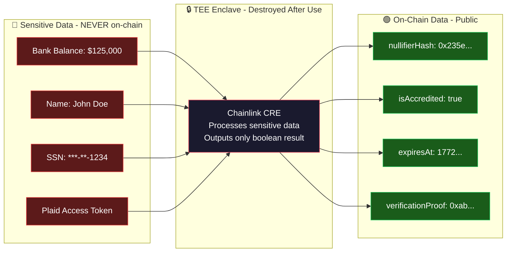

---

## 🔐 Chainlink Confidential Compute — The Core Innovation

### What is Chainlink CRE?

**Chainlink CRE (Confidential Runtime Environment)** is Chainlink's confidential computing platform that allows smart contracts to process sensitive off-chain data **without exposing it to anyone** — not even the Chainlink node operators running the computation.

It is the **backbone** of AegisGate. Without CRE, there would be no way to verify a user's bank balance and identity while keeping that data completely private.

### How TEE (Trusted Execution Environment) Works

A TEE is a hardware-isolated enclave within a processor (e.g., Intel SGX, AMD SEV) that provides:

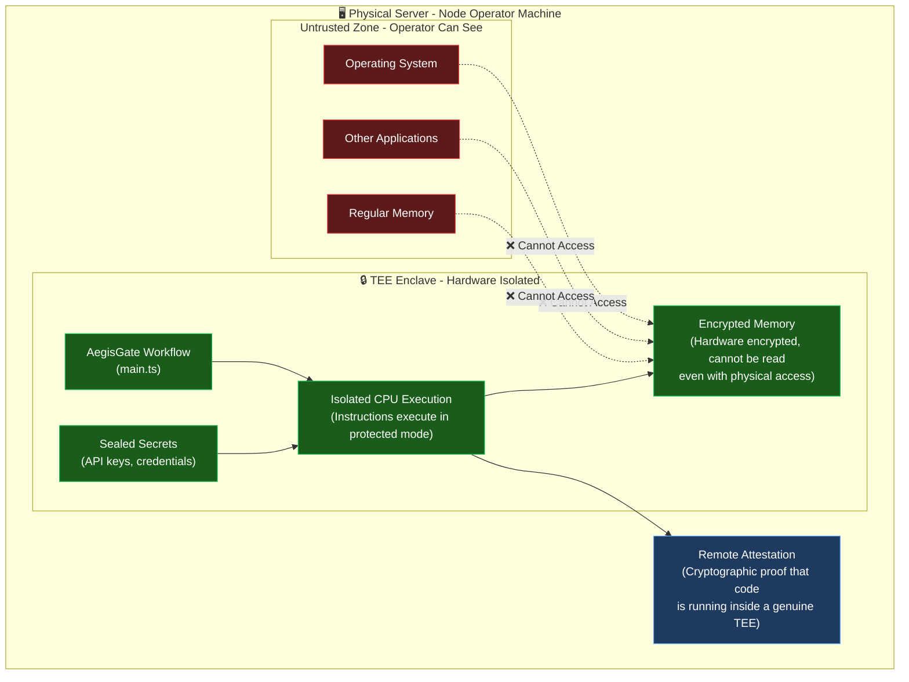

**Key Properties:**
| Property | What It Means |
|----------|--------------|
| **Memory Encryption** | All data in the TEE is encrypted in RAM — even a physical memory dump reveals nothing |
| **Isolated Execution** | Code runs on CPU in a protected mode; the host OS cannot inspect or tamper with it |
| **Remote Attestation** | The TEE generates a cryptographic proof that the _exact expected code_ is running inside a _genuine hardware enclave_ |
| **Sealed Secrets** | API keys and credentials are encrypted and can only be decrypted inside the TEE |

### Why AegisGate Needs Confidential Compute

Traditional oracle solutions expose sensitive data to node operators. AegisGate handles **financial data (bank balances)** and **identity data (World ID proofs)** — both of which are too sensitive for regular oracle processing.

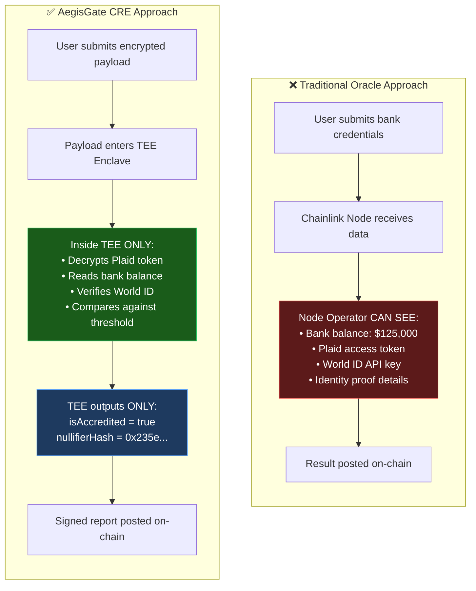

### CRE SDK Capabilities Used in AegisGate

AegisGate uses **four core CRE capabilities** — each providing a specific confidential computing function:

#### 1. `ConfidentialHTTPClient` — Encrypted External API Calls

```typescript
// Inside main.ts — World ID verification
const confHttp = new ConfidentialHTTPClient();
const worldIdReq = confHttp.sendRequest(runtime, {
  request: {
    url: `https://developer.world.org/api/v4/verify/${worldIdRpId.value}`,
    method: "POST",
    bodyString: JSON.stringify(data.worldIdFullResponse),
  },
});
```

**What makes this confidential:** The `ConfidentialHTTPClient` encrypts the entire HTTP request/response. The URL, headers, body, and response are all encrypted end-to-end. Even the Chainlink node operator running the TEE cannot see what API is being called or what data is being sent/received.

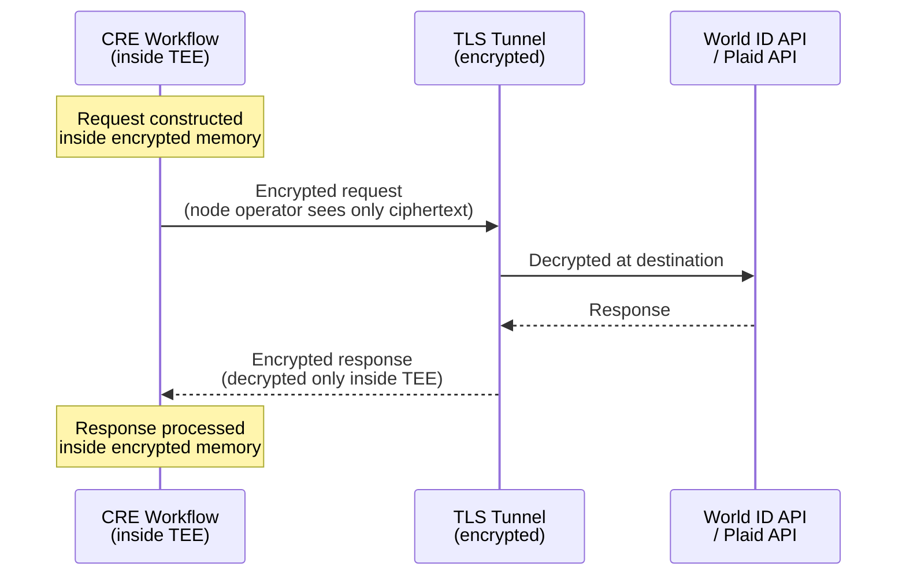

#### 2. `runtime.getSecret()` — Encrypted Secret Storage

```typescript
// Inside main.ts — retrieving Plaid API credentials
const plaidClientId = runtime.getSecret({ id: "PLAID_CLIENT_ID" }).result();
const plaidSecret = runtime.getSecret({ id: "PLAID_SECRET" }).result();
```

**What makes this confidential:** Secrets (API keys, credentials) are stored encrypted and **sealed to the TEE**. They can only be decrypted inside the genuine hardware enclave. The `secrets.yaml` file defines which secrets the workflow needs, and the CRE infrastructure ensures they are delivered encrypted and decrypted only at runtime inside the TEE.

#### 3. `EVMClient` — On-Chain Read/Write from TEE

```typescript
// Inside main.ts — reading the threshold from the smart contract
const evmClient = new EVMClient(network.chainSelector.selector);
const contractCall = evmClient
  .callContract(runtime, {
    call: encodeCallMsg({
      from: zeroAddress,
      to: evmConfig.aegisGateAddress,
      data: callData,
    }),
    blockNumber: LATEST_BLOCK_NUMBER,
  })
  .result();
```

**What makes this special:** The `EVMClient` allows the workflow to both **read** on-chain state (e.g., `minBalanceThreshold`) and **write** reports back to the blockchain — all from within the TEE. This means the workflow can make compliance decisions based on dynamic on-chain parameters without leaving the secure enclave.

#### 4. `runtime.report()` + `evmClient.writeReport()` — DON Consensus & Signed Reports

```typescript
// Inside main.ts — writing the compliance attestation on-chain
const reportResponse = runtime
  .report({
    encodedPayload: hexToBase64(reportData),
    encoderName: "evm",
    signingAlgo: "ecdsa",
    hashingAlgo: "keccak256",
  })
  .result();

const writeResult = evmClient
  .writeReport(runtime, {
    receiver: evmConfig.aegisGateAddress,
    report: reportResponse,
    gasConfig: { gasLimit: evmConfig.gasLimit },
  })
  .result();
```

**What makes this special:** This is a **two-step process**:

1. **`runtime.report()`** — The CRE DON (Decentralized Oracle Network) nodes reach **consensus** on the workflow output and produce a **collectively signed report**. This is not just one node's attestation — it's a multi-node consensus.
2. **`evmClient.writeReport()`** — The signed report is submitted to the **CRE Forwarder** contract on-chain, which verifies the DON signatures and then calls `AegisGate.onReport()` to store the compliance result.

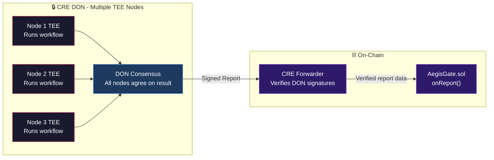

### Trust Model — Who Can See What?

| Actor                              |  Bank Balance  | Plaid API Key | World ID Proof | isAccredited Result | Nullifier Hash |
| ---------------------------------- | :------------: | :-----------: | :------------: | :-----------------: | :------------: |
| **User**                           | ✅ (their own) |      ❌       | ✅ (their own) |         ✅          |       ✅       |
| **Frontend (Next.js)**             |       ❌       |      ❌       | ✅ (transient) |         ✅          |       ✅       |
| **Chainlink Node Operator**        |       ❌       |      ❌       |       ❌       |         ✅          |       ✅       |
| **TEE Enclave (during execution)** |       ✅       |      ✅       |       ✅       |         ✅          |       ✅       |
| **Smart Contract (on-chain)**      |       ❌       |      ❌       |       ❌       |         ✅          |       ✅       |
| **DeFi Protocol**                  |       ❌       |      ❌       |       ❌       |         ✅          |       ❌       |
| **General Public**                 |       ❌       |      ❌       |       ❌       |         ✅          |       ✅       |

> **Key insight:** The TEE enclave sees everything _during execution_, but this data exists only in hardware-encrypted memory and is destroyed when execution completes. No human or software outside the TEE can access it.

### CRE Workflow Configuration

The CRE workflow is configured through three files:

**`workflow.yaml`** — Defines the workflow entry point and configuration:

```yaml
staging-settings:
  user-workflow:
    workflow-name: "workflow-staging"
  workflow-artifacts:
    workflow-path: "./main.ts"
    config-path: "./config/config.staging.json"
    secrets-path: "../secrets.yaml"
```

**`config.staging.json`** — Chain-specific configuration (non-sensitive):

```json
{
  "evms": [
    {
      "aegisGateAddress": "0x5D934Ed328963DF0CB0b69d986c604e9BcC11cfE",
      "chainName": "ethereum-testnet-sepolia",
      "gasLimit": "500000"
    }
  ]
}
```

**`secrets.yaml`** — References to encrypted secrets (delivered to TEE only):

```yaml
secrets:
  WORLD_APP_RP_ID: "<encrypted-and-sealed-to-TEE>"
  PLAID_CLIENT_ID: "<encrypted-and-sealed-to-TEE>"
  PLAID_SECRET: "<encrypted-and-sealed-to-TEE>"
```

---

## 🔄 How It Works

### End-to-End Verification Flow

```mermaid
sequenceDiagram
    actor User
    participant Frontend as 🖥️ Frontend
    participant WorldID as 🌐 World ID
    participant Plaid as 🏦 Plaid
    participant CRE as 🔒 CRE TEE
    participant Contract as ⛓️ AegisGate.sol
    participant DeFi as 🏛️ DeFi Protocol

    Note over User,DeFi: Phase 1 — User Verification (Client-Side)

    User->>Frontend: 1. Enter wallet address
    User->>Frontend: 2. Click "Verify with World ID"
    Frontend->>WorldID: Open IDKit Widget
    WorldID-->>Frontend: Proof of unique personhood<br/>(nullifier + merkle proof)

    User->>Frontend: 3. Click "Connect Bank via Plaid"
    Frontend->>Plaid: Open Plaid Link
    Plaid-->>Frontend: Public token (one-time use)

    User->>Frontend: 4. Click "Submit to CRE Enclave"
    Frontend->>Frontend: Generate JSON payload<br/>{wallet, worldIdData, plaidToken}

    Note over User,DeFi: Phase 2 — Confidential Verification (TEE)

    Frontend->>CRE: Send payload to CRE Simulator

    rect rgb(26, 26, 46)
        Note over CRE: 🔒 Inside Trusted Execution Environment
        CRE->>WorldID: Step 1: Verify proof (Confidential HTTPS)
        WorldID-->>CRE: Verified: Unique human

        CRE->>Plaid: Step 2: Exchange public_token to access_token
        Plaid-->>CRE: access_token (encrypted in TEE memory)

        CRE->>Contract: Step 3: Read minBalanceThreshold
        Contract-->>CRE: 100000 (= $1,000 in cents)

        CRE->>Plaid: Step 4: Get account balances
        Plaid-->>CRE: Balance: $125,000
        CRE->>CRE: $125,000 >= $1,000 PASS

        CRE->>CRE: Step 5: Build attestation proof
        CRE->>Contract: Step 6: writeReport via Forwarder to onReport()
    end

    Note over User,DeFi: Phase 3 — On-Chain Access Control

    Contract->>Contract: Store compliance record<br/>(nullifier to isAccredited: true)

    User->>Frontend: 5. Check compliance status
    Frontend->>Contract: isCompliant(wallet)
    Contract-->>Frontend: true

    DeFi->>Contract: checkCompliance(wallet)
    Contract-->>DeFi: true (user can access protocol)
```

### Step-by-Step Breakdown

| Step   | What Happens                                                 | Where                | Privacy                                                 |
| ------ | ------------------------------------------------------------ | -------------------- | ------------------------------------------------------- |
| **1**  | User enters their Ethereum wallet address                    | Frontend             | ✅ Public (wallet addresses are public)                 |
| **2**  | User scans QR code with World App to prove unique personhood | World ID             | ✅ Zero-knowledge proof — no identity revealed          |
| **3**  | User connects their bank account via Plaid Link              | Plaid                | ⚠️ Token only — no data leaves Plaid yet                |
| **4**  | Frontend bundles all data into a JSON payload                | Frontend             | ⚠️ Contains sensitive tokens (handled locally)          |
| **5**  | Payload sent to Chainlink CRE for processing                 | CRE TEE              | 🔒 All processing in encrypted TEE enclave              |
| **6**  | CRE verifies World ID proof via confidential HTTPS           | CRE TEE → World ID   | 🔒 API calls are encrypted, invisible to node operators |
| **7**  | CRE exchanges Plaid token & checks bank balance              | CRE TEE → Plaid      | 🔒 Balance checked but never stored or revealed         |
| **8**  | CRE reads threshold from smart contract                      | CRE TEE → Blockchain | ✅ Public on-chain read                                 |
| **9**  | CRE writes compliance attestation on-chain via signed report | CRE TEE → Blockchain | ✅ Only boolean result + nullifier stored               |
| **10** | DeFi protocols query `isCompliant(wallet)`                   | Blockchain           | ✅ Simple boolean — no sensitive data                   |

---

## 🛠 Tech Stack

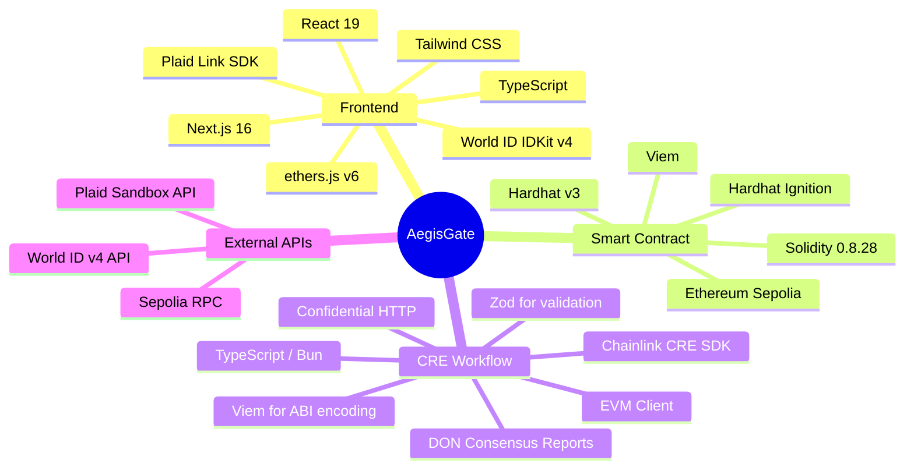

| Layer                    | Technology                            | Purpose                                                 |
| ------------------------ | ------------------------------------- | ------------------------------------------------------- |
| **Frontend**             | Next.js 16, React 19, Tailwind CSS    | User interface and verification flow                    |
| **Identity**             | World ID IDKit v4, `@worldcoin/idkit` | Zero-knowledge proof of unique personhood               |
| **Banking**              | Plaid Link SDK, Plaid API             | Secure bank account connection and balance verification |
| **Confidential Compute** | Chainlink CRE SDK, TEE (Enclave)      | Privacy-preserving orchestration of sensitive checks    |
| **Smart Contract**       | Solidity 0.8.28, Hardhat v3           | On-chain compliance records and DeFi access control     |
| **Blockchain**           | Ethereum Sepolia (Testnet)            | Deployment network for smart contract                   |
| **Deployment**           | Hardhat Ignition                      | Declarative smart contract deployment                   |

---

## 📂 Project Structure

```
aegis-gate/
├── client/                          # 🖥️ Next.js Frontend Application
│   ├── app/
│   │   ├── page.tsx                 # Main verification flow page
│   │   ├── layout.tsx               # Root layout with metadata
│   │   ├── globals.css              # Global styles
│   │   ├── components/
│   │   │   ├── WalletInput.tsx      # Step 1: Wallet address input
│   │   │   ├── WorldIdVerification.tsx # Step 2: World ID verification
│   │   │   ├── BankVerification.tsx  # Step 3: Plaid bank connection
│   │   │   ├── SubmitEnclave.tsx     # Step 4: Submit to CRE Enclave
│   │   │   └── ComplianceStatus.tsx  # Step 5: Check on-chain status
│   │   ├── api/
│   │   │   ├── world-id/
│   │   │   │   ├── sign/route.ts    # Generate World ID secure context
│   │   │   │   └── verify/route.ts  # Verify World ID proof (server-side)
│   │   │   ├── plaid/
│   │   │   │   ├── create_link_token/route.ts  # Generate Plaid Link token
│   │   │   │   └── set_access_token/route.ts   # Exchange Plaid public token
│   │   │   └── contract/
│   │   │       ├── compliance/route.ts  # Read compliance status from chain
│   │   │       └── whitelist/route.ts   # Admin: update compliance on-chain
│   │   ├── admin/                   # Admin dashboard page
│   │   └── lib/
│   │       └── contractConfig.ts    # ABI, contract address, ethers provider
│   └── package.json
│
├── contracts/                       # ⛓️ Solidity Smart Contract
│   ├── contracts/
│   │   └── AegisGate.sol            # Core privacy-preserving compliance contract
│   ├── ignition/
│   │   └── modules/
│   │       └── AegisGate.ts         # Deployment module (Hardhat Ignition)
│   ├── hardhat.config.ts            # Hardhat v3 configuration (Sepolia network)
│   └── package.json
│
├── workflow/                        # 🔒 Chainlink CRE Workflow
│   ├── my-workflow/
│   │   ├── main.ts                  # Workflow entrypoint (6-step verification)
│   │   ├── workflow.yaml            # CRE workflow configuration
│   │   ├── config/
│   │   │   ├── config.staging.json  # Staging: contract address + chain config
│   │   │   └── config.production.json
│   │   ├── contracts/
│   │   │   └── abi/                 # AegisGate ABI for on-chain interactions
│   │   └── package.json
│   ├── project.yaml                 # CRE project-level settings (RPCs)
│   ├── secrets.yaml                 # Secret references (Plaid keys, World ID)
│   └── data.txt                     # Sample simulation payload
│
└── README.md                        # 📄 This file
```

---

## ⛓️ Smart Contract Deep Dive

### `AegisGate.sol` — On-Chain Compliance Registry

The smart contract is the **final source of truth** for compliance status. It stores only the minimum data needed for DeFi protocols to gate access.

#### Contract Architecture

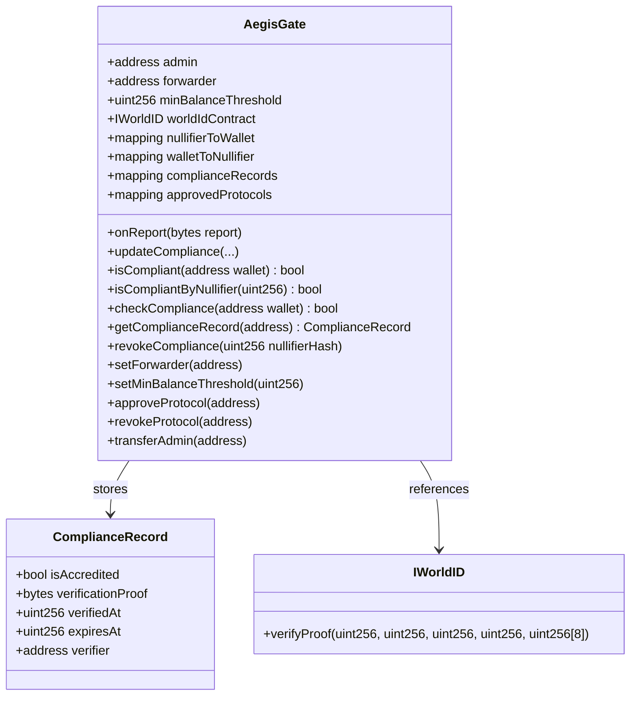

#### Key Design Decisions

| Feature                   | Implementation                                                                     | Why                                                                |
| ------------------------- | ---------------------------------------------------------------------------------- | ------------------------------------------------------------------ |
| **Sybil Resistance**      | `nullifierToWallet` mapping prevents one World ID from linking to multiple wallets | Prevents gaming the system with multiple wallets                   |
| **Forwarder Pattern**     | `onReport()` only callable by the CRE Forwarder address                            | Ensures only verified TEE output can update compliance             |
| **Expiring Verification** | `expiresAt` timestamp on each record                                               | Compliance status automatically expires, requiring re-verification |
| **Protocol Gating**       | `approvedProtocols` mapping with `checkCompliance()`                               | Only whitelisted DeFi protocols can query compliance               |
| **Admin Override**        | `updateCompliance()` with `onlyAdmin` modifier                                     | Emergency manual compliance updates                                |

#### Deployed Contract

| Property                  | Value                                                                                                                           |
| ------------------------- | ------------------------------------------------------------------------------------------------------------------------------- |
| **Network**               | Ethereum Sepolia (Testnet)                                                                                                      |
| **Contract Address**      | [`0x5D934Ed328963DF0CB0b69d986c604e9BcC11cfE`](https://sepolia.etherscan.io/address/0x5D934Ed328963DF0CB0b69d986c604e9BcC11cfE) |
| **CRE Forwarder**         | `0x15fc6ae953e024d975e77382eeec56a9101f9f88`                                                                                    |
| **World ID Router**       | `0x469449f251692e0779667583026b5a1e99512157`                                                                                    |
| **Min Balance Threshold** | 100,000 cents ($1,000)                                                                                                          |

---

## 🔒 CRE Workflow Deep Dive

### `main.ts` — The Confidential Verification Pipeline

The CRE workflow is the **core innovation** of AegisGate. It runs inside a Chainlink **Trusted Execution Environment (TEE)**, meaning even the node operators cannot see the sensitive data being processed.

#### Workflow Pipeline

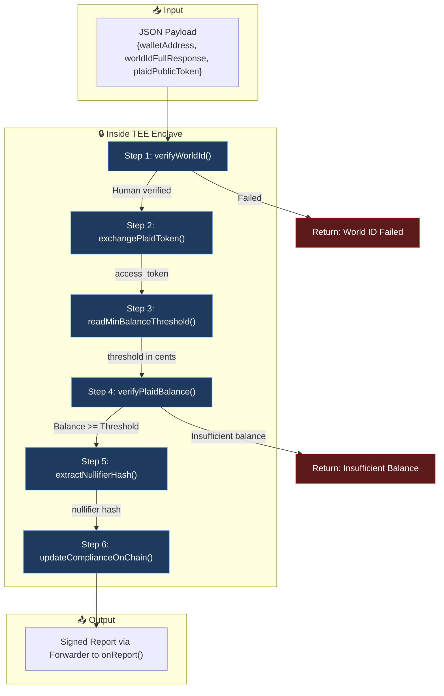

#### Step Details

| Step  | Function                    | API Used                                   | What Happens                                                                                                                                                    |
| ----- | --------------------------- | ------------------------------------------ | --------------------------------------------------------------------------------------------------------------------------------------------------------------- |
| **1** | `verifyWorldId()`           | World ID `/api/v4/verify`                  | Sends the World ID proof to the official API via **Confidential HTTPS** (encrypted, invisible to node operators). Returns `true` if the user is a unique human. |
| **2** | `exchangePlaidToken()`      | Plaid `/item/public_token/exchange`        | Exchanges the one-time Plaid public token for a temporary access token — all within the TEE.                                                                    |
| **3** | `readMinBalanceThreshold()` | On-chain `AegisGate.minBalanceThreshold()` | Reads the configurable minimum balance from the smart contract using the EVM Client.                                                                            |
| **4** | `verifyPlaidBalance()`      | Plaid `/accounts/balance/get`              | Fetches the user's bank balance, sums all available balances, converts to cents, and compares against the on-chain threshold.                                   |
| **5** | `extractNullifierHash()`    | (Local computation)                        | Extracts the World ID nullifier hash from the IDKit response — this is the anonymous identifier stored on-chain.                                                |
| **6** | `updateComplianceOnChain()` | On-chain `AegisGate.onReport()`            | ABI-encodes the compliance result, generates a **signed report** (DON consensus), and submits it via the Forwarder contract.                                    |

---

## 🖥️ Frontend Deep Dive

### User Interface Flow

The frontend guides users through a **5-step verification wizard**:

```mermaid
stateDiagram-v2
    [*] --> WalletInput: Step 1
    WalletInput --> WorldID: Wallet entered
    WorldID --> BankVerify: World ID verified
    BankVerify --> Submit: Bank connected
    Submit --> Status: Payload generated
    Status --> [*]: Compliance checked

    state WalletInput {
        [*] --> EnterAddress
        EnterAddress --> ValidAddress: Valid 0x address
    }

    state WorldID {
        [*] --> OpenIDKit
        OpenIDKit --> ScanQR: IDKit popup appears
        ScanQR --> ProofGenerated: World App scan
    }

    state BankVerify {
        [*] --> OpenPlaid
        OpenPlaid --> SelectBank: Plaid Link popup
        SelectBank --> TokenReceived: Bank connected
    }

    state Submit {
        [*] --> GeneratePayload
        GeneratePayload --> ShowModal: JSON payload created
        ShowModal --> CopyPayload: User copies payload
    }

    state Status {
        [*] --> QueryChain
        QueryChain --> ShowResult: Read from AegisGate.sol
    }
```

### Components

| Component             | File                                 | Responsibility                                                                      |
| --------------------- | ------------------------------------ | ----------------------------------------------------------------------------------- |
| `WalletInput`         | `components/WalletInput.tsx`         | Captures and validates the user's Ethereum wallet address                           |
| `WorldIdVerification` | `components/WorldIdVerification.tsx` | Integrates the World ID `IDKitRequestWidget` for zero-knowledge proof of personhood |
| `BankVerification`    | `components/BankVerification.tsx`    | Opens Plaid Link for secure bank account connection                                 |
| `SubmitEnclave`       | `components/SubmitEnclave.tsx`       | Bundles all verification data into a JSON payload for the CRE simulator             |
| `ComplianceStatus`    | `components/ComplianceStatus.tsx`    | Reads compliance status directly from the AegisGate smart contract on Sepolia       |
| `StepIndicator`       | `page.tsx` (inline)                  | Visual progress bar showing completion of each verification step                    |

### API Routes

| Route                          | Method | Purpose                                                                         |
| ------------------------------ | ------ | ------------------------------------------------------------------------------- |
| `/api/world-id/sign`           | POST   | Generates a secure `RpContext` for the World ID verification session            |
| `/api/world-id/verify`         | POST   | Server-side verification of World ID proofs (optional; CRE is primary verifier) |
| `/api/plaid/create_link_token` | POST   | Generates a Plaid Link token for the frontend Plaid UI                          |
| `/api/plaid/set_access_token`  | POST   | Exchanges a Plaid public token for an access token                              |
| `/api/contract/compliance`     | GET    | Reads `isCompliant()` and `getComplianceRecord()` from Sepolia                  |
| `/api/contract/whitelist`      | POST   | Admin endpoint to manually update compliance via the contract                   |

---

## 🚀 Getting Started

### Prerequisites

- **Node.js** v18+ and **pnpm** (or npm/yarn)
- **Bun** (for CRE workflow development)
- **Chainlink CRE CLI** (`cre-cli`) for workflow simulation/deployment
- A **World App** account (for testing World ID)
- A **Plaid** developer account (sandbox mode is free)

### 1. Clone the Repository

```bash
git clone https://github.com/your-username/aegis-gate.git
cd aegis-gate
```

### 2. Smart Contract Setup

```bash
cd contracts
pnpm install

# Compile the contract
npx hardhat compile

# Deploy to Sepolia (requires SEPOLIA_RPC_URL and SEPOLIA_PRIVATE_KEY in env)
npx hardhat ignition deploy ignition/modules/AegisGate.ts --network sepolia
```

### 3. Frontend Setup

```bash
cd client
pnpm install
```

Create a `.env` file in `client/`:

```env
# World ID
NEXT_PUBLIC_WORLD_APP_ID=app_<your_world_app_id>
WORLD_APP_SECRET=sk_<your_world_app_secret>

# Plaid (Sandbox)
PLAID_CLIENT_ID=<your_plaid_client_id>
PLAID_SECRET=<your_plaid_sandbox_secret>

# Blockchain
SEPOLIA_RPC_URL=https://ethereum-sepolia-rpc.publicnode.com
```

Start the development server:

```bash
pnpm run dev
# Open http://localhost:3000
```

### 4. CRE Workflow Setup

```bash
cd workflow/my-workflow
bun install
```

Create a `../secrets.yaml`:

```yaml
secrets:
  WORLD_APP_RP_ID: "<your-world-app-rp-id>"
  PLAID_CLIENT_ID: "<your-plaid-client-id>"
  PLAID_SECRET: "<your-plaid-sandbox-secret>"
```

Simulate the workflow:

```bash
cre-cli simulate --project-dir ../ --workflow-dir ./ --target staging-settings
```

When prompted, paste the JSON payload generated by the frontend (or use `data.txt` as a reference).

---

## 🎬 Demo

### User Flow

1. **Open the app** at `http://localhost:3000`
2. **Enter your Ethereum wallet address** (Step 1)
3. **Click "Verify with World ID"** → Scan the QR code with your World App (Step 2)
4. **Click "Connect Bank via Plaid"** → Select a sandbox bank account (Step 3)
5. **Click "Submit to CRE Enclave"** → Copy the generated JSON payload (Step 4)
6. **Run the CRE simulation** in your terminal with the copied payload
7. **Click "Check Compliance Status"** → See your on-chain accreditation status (Step 5)

---

## 🔐 Security Considerations

| Concern                             | Mitigation                                                                                     |
| ----------------------------------- | ---------------------------------------------------------------------------------------------- |
| **Plaid secrets on-chain**          | Never stored on-chain; only processed inside TEE enclave via `ConfidentialHTTPClient`          |
| **World ID replay attacks**         | Nullifier hash is unique per action; re-using the same proof will fail verification            |
| **Sybil attacks**                   | One World ID nullifier can only be linked to one wallet address (`nullifierToWallet` mapping)  |
| **Unauthorized compliance updates** | `onReport()` restricted to the CRE Forwarder address; `updateCompliance()` restricted to admin |
| **Expired verifications**           | `expiresAt` timestamp ensures compliance records automatically expire                          |
| **Rogue DeFi queries**              | `checkCompliance()` restricted to `approvedProtocols` only                                     |
| **TEE compromise**                  | Chainlink's multi-node DON consensus means a single compromised TEE cannot forge reports       |
| **Node operator collusion**         | CRE's confidential HTTP ensures API keys and data are encrypted even from node operators       |
| **Man-in-the-middle attacks**       | All external API calls from TEE use end-to-end encrypted TLS tunnels                           |

---

## 🗺️ Future Roadmap

- [ ] **Multi-Chain Deployment** — Deploy AegisGate on Arbitrum, Optimism, Base, and Polygon
- [ ] **Real Plaid Integration** — Move from Sandbox to Production Plaid API with real bank verification
- [ ] **On-Chain World ID Verification** — Verify World ID proofs directly in the smart contract using the World ID Router
- [ ] **DeFi Protocol SDK** — Publish an npm package for protocols to easily integrate `isCompliant()` checks
- [ ] **Compliance Dashboard** — Full admin dashboard with analytics, revocation management, and audit logs
- [ ] **Threshold Governance** — Allow DAO governance to vote on the `minBalanceThreshold` value
- [ ] **ZK-Proof Upgrades** — Replace boolean attestation with ZK range proofs (e.g., "balance > $X" without revealing exact amount)
- [ ] **Mobile Wallet Integration** — Support WalletConnect and mobile-native verification flows

---

## 📜 License

This project was built for a hackathon and is provided as-is for demonstration purposes.

---

<div align="center">

**Built with ❤️ using Chainlink CRE · World ID · Plaid · Ethereum**

_AegisGate — Where compliance meets privacy._

</div>
